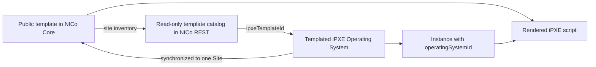

# Templated iPXE Operating Systems

Templated iPXE Operating Systems let NICo reuse a validated iPXE script
template while supplying the parameters and boot artifacts that vary between
operating-system definitions. They replace most uses of raw `ipxeScript`,
which is deprecated in the REST API.

This guide explains the template and Operating System resources, ownership and
site rules, synchronization between NICo REST and NICo Core, and the workflow
for creating and using a templated Operating System.

## How the Resources Fit Together

The feature has three layers:

1. **iPXE template** -- a read-only script blueprint built into NICo Core. It
   declares required parameters, reserved parameters, and required artifacts.
2. **Templated iPXE Operating System** -- a reusable definition that references
   one template and supplies its parameter values, artifact URLs, user data,
   and boot policy.
3. **Instance** -- references the Operating System by UUID. NICo Core combines
   the definition with site- and machine-specific reserved values and renders
   the final iPXE script when the machine boots.



Templates and Operating Systems are different resources. A template describes
the placeholders and script structure. An Operating System provides concrete
values for one use of that template.

## Template Discovery and Availability

iPXE templates are currently compiled into NICo Core and are read-only. Only
templates with `Public` visibility are synchronized to NICo REST.

REST stores one global template record for each stable Core UUID and tracks
which Sites currently report it. Consequently:

- A template can be listed only at Sites where it is available.
- The same template UUID reported by multiple Sites is represented once.
- Removing the last Site association removes the template from the REST
  catalog.
- Templates cannot be created, updated, or deleted through the REST API.

List the templates available at the target Site:

```bash
nicocli ipxe-template list \
  --site-id <site-uuid> \
  --all \
  --output table
```

Inspect the selected template:

```bash
nicocli ipxe-template get <template-uuid>
```

Before creating an Operating System, note these fields:

| Field | Meaning |
|---|---|
| `id` | Stable UUID to send as `ipxeTemplateId` |
| `requiredParams` | Parameter names the Operating System must provide |
| `reservedParams` | Values supplied by NICo Core at render time; do not provide them |
| `requiredArtifacts` | Artifact names the Operating System must provide |
| `visibility` | Only `Public` templates are available through REST |

## Ownership and Authorization

Ownership is inferred from the caller's organization and role. The deprecated
`tenantId` and `infrastructureProviderId` request fields should not be used.

| Caller | Create behavior | Read behavior | Update and delete |
|---|---|---|---|
| Provider Admin | May create only Templated iPXE Operating Systems at a Registered Site owned by its provider. The result is provider-owned. | Sees its provider-owned definitions. | May modify its provider-owned definitions. |
| Tenant Admin | May create a tenant-owned Templated iPXE Operating System at a Registered Site accessible to the tenant. | Sees tenant-owned definitions plus provider-owned definitions associated with an accessible Site. | May modify only tenant-owned definitions. |
| Dual-role user | Provider ownership takes priority when creating a Templated iPXE Operating System. | Sees the union of its provider and tenant views. | Authorization follows the resource owner. |
| Provider Viewer | Cannot create or modify Operating Systems. | Can discover templates available at provider Sites. | None. |

Visibility does not grant mutation rights. In addition, Instance creation
currently requires the selected Operating System to be tenant-owned.
Provider-owned definitions visible to a Tenant are read-only catalog entries;
create a tenant-owned definition when a tenant workload must reference it.

## Site Rules

A Templated iPXE Operating System created through REST must specify exactly one
Site:

```json
{
  "siteIds": ["<site-uuid>"]
}
```

Although `siteIds` is an array for compatibility with the existing Operating
System API, zero or multiple values are rejected for this type.

The Site must:

- Exist and be in `Registered` status.
- Be owned by the Provider for a provider-owned definition, or be accessible
  to the Tenant for a tenant-owned definition.
- Report the referenced iPXE template.

The Site association is fixed at creation and cannot be updated. There is no
Operating System `scope` field, no `Global` auto-expansion, and no automatic
association when new Sites are registered.

## Create a Templated iPXE Operating System

The following example uses the built-in `kernel-initrd` template. That template
requires the `kernel_params` parameter and the `kernel` and `initrd` artifacts.
Always inspect the template returned by your deployment instead of assuming
that its requirements match this example.

Array-valued fields are easiest to supply with `--data-file`:

```bash
nicocli operating-system create --data-file - <<'EOF'
{
  "name": "ubuntu-24.04-autoinstall",
  "description": "Ubuntu 24.04 automated installation",
  "siteIds": ["<site-uuid>"],
  "ipxeTemplateId": "<kernel-initrd-template-uuid>",
  "ipxeTemplateParameters": [
    {
      "name": "kernel_params",
      "value": "ip=dhcp autoinstall"
    }
  ],
  "ipxeTemplateArtifacts": [
    {
      "name": "kernel",
      "url": "https://artifacts.example.com/ubuntu/vmlinuz",
      "cacheStrategy": "CacheAsNeeded"
    },
    {
      "name": "initrd",
      "url": "https://artifacts.example.com/ubuntu/initrd",
      "cacheStrategy": "CacheAsNeeded"
    }
  ],
  "userData": "#cloud-config\nhostname: ubuntu-worker\n",
  "phoneHomeEnabled": false,
  "allowOverride": true
}
EOF
```

The request type is inferred from `ipxeTemplateId`; do not send a separate
`type` value. `ipxeTemplateId` is mutually exclusive with `ipxeScript` and
`imageUrl`.

### Parameters

Each parameter has a `name` and `value`.

- Supply every name in `requiredParams` with a non-empty value.
- Do not supply names in `reservedParams`; NICo Core provides those values.
- Extra parameters are accepted only when the template supports its extra
  placeholder.
- Parameter names must be unique within the Operating System definition.

### Artifacts

Each artifact requires `name` and `url`. Optional fields are:

- `sha` -- expected SHA-256 checksum.
- `authType` -- `Basic` or `Bearer`.
- `authToken` -- credential used to retrieve the artifact.
- `cacheStrategy` -- one of the strategies below.

| Strategy | URL used at boot |
|---|---|
| `CacheAsNeeded` | Prefer the Site's cached URL; fall back to the supplied URL. |
| `RemoteOnly` | Always use the supplied URL. |
| `LocalOnly` | Use the supplied URL directly; it is already Site-local. |
| `CachedOnly` | Require a cached URL at the Site; rendering cannot proceed until one exists. |

Artifact `authToken` values are accepted on create and update but are
structurally omitted from REST API responses. Treat them as write-only
credentials.

The per-Site `cachedUrl` value is managed by NICo Core and is not stored or
returned by NICo REST. Core's cache-management gRPC operations are the only
supported way to set or clear it. A `CachedOnly` artifact without a cached URL
keeps the Core definition from becoming ready.

After a cache service has downloaded an artifact, a Site administrator can
record its Site-local URL directly in Core:

```bash
nico-admin-cli operating-system set-cached-url \
  --set kernel=https://cache.example.com/ubuntu/vmlinuz \
  <operating-system-uuid>
```

Repeat `--set` for multiple artifacts. Use `--set <name>=` to clear a cached
URL.

## Create a Site-Local Definition in Core

The REST API is the preferred interface for normal operations. A Site
administrator can also create a definition directly in Core with
`nico-admin-cli`. For example, the built-in `qcow-image` template requires the
`image_url` parameter:

```bash
nico-admin-cli operating-system create \
  --name site-qcow-image \
  --ipxe-template-id ea756ddd-add3-5e42-a202-44bfc2d5aac2 \
  --param image_url=https://artifacts.example.com/images/ubuntu.qcow2
```

The optional `--org` flag controls how REST assigns ownership when it discovers
the definition:

- Omit `--org` to create a provider-owned definition for the reporting Site.
- Set `--org <tenant-organization-id>` to create a tenant-owned definition.
  REST must be able to resolve that organization to an existing Tenant.
- An explicitly empty organization is invalid.

The discovered definition has one Site association and therefore participates
in bidirectional synchronization.

## Verify Synchronization

Capture the returned Operating System UUID and inspect it:

```bash
nicocli operating-system get <operating-system-uuid>
```

This response contains the definition, aggregate `status`, and `statusHistory`.
The get-by-ID response does not currently expand Site associations for
Templated iPXE definitions. Use the Site-filtered list response to inspect the
association:

```bash
nicocli operating-system list \
  --site-id <site-uuid> \
  --type TemplatedIpxe \
  --all
```

Wait for the target `siteAssociations` entry to become `Synced` before
selecting the Operating System for an Instance.

Common association states are:

| State | Meaning |
|---|---|
| `Syncing` | REST is sending or re-sending the definition to the Site. |
| `Synced` | The Site accepted the definition. |
| `Error` | The Site proxy operation or association bookkeeping failed; inspect status history. |
| `Deleting` | Site cleanup is in progress. |

Updates temporarily return the association to `Syncing`. Instance create and
update reject a Templated iPXE Operating System unless its association with the
Instance's Site is `Synced`.

## Use the Operating System for an Instance

For a tenant-owned definition, pass its UUID as `operatingSystemId`. The
Instance's VPC and the Operating System must resolve to the same Site.

```bash
nicocli instance create \
  --name ubuntu-worker-01 \
  --tenant-id <tenant-uuid> \
  --vpc-id <vpc-uuid> \
  --instance-type-id <instance-type-uuid> \
  --operating-system-id <operating-system-uuid>
```

NICo sends the Operating System UUID to Core rather than expanding the template
in REST. Core retrieves the synchronized definition, supplies reserved
machine/Site values, validates the definition hash, resolves artifact URLs,
and renders the final iPXE script.

If `allowOverride` is enabled, Instance request fields can override supported
Operating System settings such as user data. See
[Tenant Management](tenant_management.md#launching-an-instance) for the full
Instance workflow.

## Update a Definition

Update only the fields that should change. Omitted fields retain their current
values. Supplying a parameter or artifact array replaces the complete
corresponding list; an explicit empty array clears it if the resulting
definition remains valid.

```bash
nicocli operating-system update --data-file - <operating-system-uuid> <<'EOF'
{
  "description": "Ubuntu 24.04 automated installation, revision 2",
  "ipxeTemplateParameters": [
    {
      "name": "kernel_params",
      "value": "ip=dhcp autoinstall console=ttyS0,115200"
    }
  ]
}
EOF
```

The Operating System type and Site association cannot be changed. To target a
different Site, create another Operating System definition.

## Delete a Definition

```bash
nicocli operating-system delete <operating-system-uuid>
```

REST marks the definition and its Site association as deleting, asks Core to
remove the Site copy, and records an actionable error state if Site cleanup
fails. Deletion is rejected while an Instance references the definition.

## Synchronization and Source of Truth

Templates and Operating Systems use different synchronization rules:

- **Templates:** one-way from Core to REST. REST aggregates the Public
  templates reported by authorized Sites.
- **Operating Systems with one Site association:** definition changes are
  bidirectional. REST compares update timestamps during inventory
  reconciliation.
- **Operating Systems with multiple Site associations:** REST is the source of
  truth so divergent Site definitions cannot overwrite one another.

REST currently creates a Templated iPXE Operating System with exactly one Site,
but the multi-Site rule protects existing or administratively-created records.
Reconciliation-by-absence applies only to single-Site definitions: if Core no
longer reports one at that Site, REST soft-deletes it. A multi-Site definition
is not deleted merely because one Site omits it.

When Core reports a previously unknown Operating System:

- A present `tenant_organization_id` resolves it as tenant-owned.
- An omitted `tenant_organization_id` resolves it as provider-owned using the
  reporting Site's Infrastructure Provider.

## Troubleshooting

| Symptom | Cause and resolution |
|---|---|
| No templates are returned for the Site | Confirm the Site is Registered, the template is Public, Core reports it, and the caller is authorized for the Site. |
| `exactly one siteId must be specified` | Send one UUID in `siteIds`; do not omit it or send multiple Sites. |
| Template is not available at the target Site | List templates with `--site-id <site-uuid>` and use an ID from that response. |
| Missing or reserved parameter error | Compare the request with `requiredParams` and `reservedParams` from `ipxe-template get`. |
| Missing artifact error | Supply every name in `requiredArtifacts`; names are case-sensitive. |
| Operating System is not synchronized to the Instance's Site | Wait for the Site association to become `Synced`, or create the definition for the Instance's Site. |
| Definition remains non-ready with `CachedOnly` | Ensure the Site's cache service populated every required cached URL, or use another cache strategy. |
| `authToken` is absent from GET responses | This is intentional redaction. Submit a replacement token on update when credentials rotate. |
| Tenant cannot select a provider-owned definition | Instance selection currently requires tenant ownership. Create the equivalent definition as the Tenant. |

Use `nicocli --debug` to inspect REST requests and responses, and inspect the
Operating System's `statusHistory` and `siteAssociations` for synchronization
failures.

## Related Documentation

- [Tenant Management](tenant_management.md) -- Tenant setup and Instance
  provisioning.
- [Phone-home](tenant_management.md#phone-home) -- Readiness behavior controlled
  by `phoneHomeEnabled`.
- [nico-admin-cli Operating System reference](../manuals/nico-admin-cli/commands/operating-system/operating-system.md)
  -- Direct Core gRPC administration.
- [nico-admin-cli iPXE template reference](../manuals/nico-admin-cli/commands/ipxe-template/ipxe-template.md)
  -- Inspect templates directly in Core.
